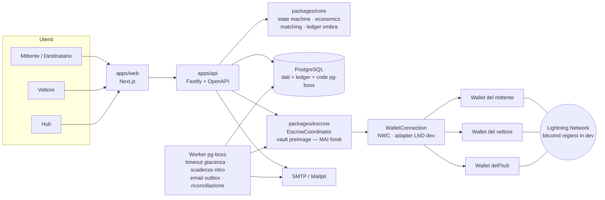
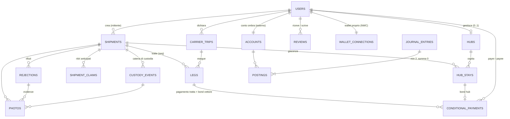
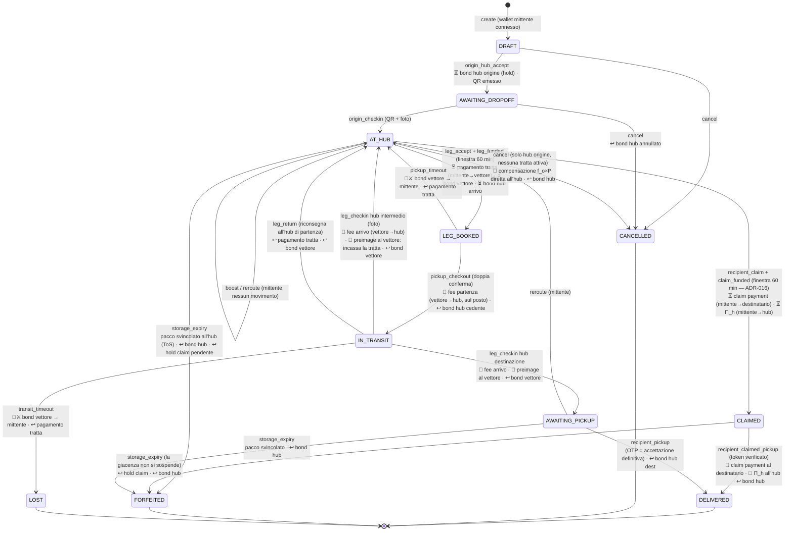

# Mercurio — Architettura

> Stato: **bozza per revisione** — 2026-07-12.
> Le decisioni chiave sono motivate negli ADR in [`/docs/adr`](adr/).
> Nessuna riga di codice è stata scritta: questo documento è il progetto da approvare.

## 1. Obiettivo del documento

Definire stack, componenti, modello dati e macchina a stati del pacco per l'MVP di
Mercurio: rete logistica peer-to-peer con pagamenti Lightning, escrow e bond.
I temi verticali sono trattati nei documenti dedicati:

| Documento                    | Contenuto                                                             |
| ---------------------------- | --------------------------------------------------------------------- |
| [ECONOMICS.md](ECONOMICS.md) | Motore economico multi-tratta (modelli, simulazioni, raccomandazione) |
| [ESCROW.md](ESCROW.md)       | Scelta del backend escrow/bond su Lightning e interfaccia astratta    |
| [MATCHING.md](MATCHING.md)   | Motore di matching vettore ↔ spedizioni                               |
| [RISKS.md](RISKS.md)         | Rischi, anti-abuso, identità, aspetti legali, domande aperte          |

## 2. Stack tecnologico

Confermata la proposta di partenza, con alcune precisazioni. Motivazioni estese negli ADR.

| Livello        | Scelta                                                                                                                 | ADR                                                                         |
| -------------- | ---------------------------------------------------------------------------------------------------------------------- | --------------------------------------------------------------------------- |
| Repo           | Monorepo TypeScript, pnpm workspaces + Turborepo                                                                       | [ADR-001](adr/ADR-001-monorepo-typescript-pnpm.md)                          |
| Web            | Next.js (App Router), mobile-first, i18n `it` default con `en` pronto                                                  | [ADR-002](adr/ADR-002-nextjs-web-fastify-api.md)                            |
| API            | Servizio Fastify separato, REST + OpenAPI generata da schema Zod                                                       | [ADR-002](adr/ADR-002-nextjs-web-fastify-api.md)                            |
| Database       | PostgreSQL 16 + Drizzle ORM (SQL esplicito, transazioni controllate)                                                   | [ADR-003](adr/ADR-003-postgresql-drizzle.md)                                |
| Lightning      | bitcoind regtest + LND (nodi _utente_ di test — la piattaforma non ha wallet) via Docker Compose                       | [ADR-004](adr/ADR-004-lnd-regtest-docker.md)                                |
| Pagamenti/bond | **Zero custodia**: hold invoice dirette tra utenti, coordinatore per preimage; wallet utente via NWC o adapter diretti | [ADR-013](adr/ADR-013-non-custodial-coordinator.md), [ESCROW.md](ESCROW.md) |
| Importi        | Tutto in **satoshi**; EUR solo per input/display con cambio fotografato                                                | [ADR-008](adr/ADR-008-amounts-in-sats.md)                                   |
| Contabilità    | Ledger a partita doppia in Postgres, nessun movimento fuori ledger                                                     | [ADR-010](adr/ADR-010-double-entry-ledger.md)                               |
| Job/timeout    | pg-boss (code su Postgres, niente Redis)                                                                               | [ADR-011](adr/ADR-011-pg-boss-jobs.md)                                      |
| Auth           | Magic link email (obbligatoria) + LNURL-auth opzionale                                                                 | [ADR-009](adr/ADR-009-auth-email-lnurl.md)                                  |
| Distanze       | Haversine × fattore di circuità 1.3, dietro interfaccia `DistanceProvider`                                             | [ADR-007](adr/ADR-007-haversine-distance.md)                                |
| Email          | Adapter SMTP; Mailpit in dev; outbox pattern (invii solo post-commit)                                                  | —                                                                           |

### Struttura del monorepo

```
mercurio/
├── apps/
│   ├── web/            # Next.js — UI italiana, mobile-first, Bitcoin Design Guide
│   └── api/            # Fastify — API pubblica REST, OpenAPI, wallet-event handler
├── packages/
│   ├── core/           # Dominio puro: macchina a stati, economics, matching, ledger.
│   │                   # Zero I/O: solo funzioni testabili. Qui vive tutta la logica di denaro.
│   ├── db/             # Schema Drizzle, migrazioni, repository
│   ├── escrow/         # EscrowCoordinator (vault preimage) + WalletConnection (NWC, LND dev, fake per i test)
│   └── shared/         # Tipi condivisi, schema Zod delle API, costanti
├── infra/
│   └── docker/         # docker-compose: postgres, bitcoind regtest, lnd×3, lnbits, mailpit
└── docs/
```

Regola strutturale: **`packages/core` non importa nulla che faccia I/O**. La macchina a
stati e il motore economico sono funzioni pure `(stato, evento) → (nuovo stato, effetti)`;
`apps/api` esegue gli effetti (scritture DB, chiamate escrow, email) in transazione.
Questo rende testabile al 100% la logica di denaro (requisito del CLAUDE.md).

## 3. Diagramma dei componenti



Note:

- **La piattaforma non ha un wallet**: ogni pagamento è una hold invoice o una
  invoice istantanea _tra due utenti_; il coordinatore detiene solo le preimage
  (ESCROW.md §2). I fondi non toccano mai Mercurio.
- I **worker** girano nello stesso processo di `apps/api` nell'MVP (pg-boss lo consente);
  separabili in seguito senza cambi di codice.
- Il **job di riconciliazione** confronta ogni notte le scritture del ledger ombra con
  lo stato reale delle invoice nei wallet degli utenti e apre un alert su divergenza.
- Le API sono pubbliche e documentate (OpenAPI servita su `/docs`): l'app mobile futura
  e integrazioni terze usano le stesse rotte del web.

## 4. Modello dati (ER)

Convenzioni: chiavi UUID v7, timestamp UTC `timestamptz`, importi `bigint` in **msat**
(arrotondati al sat nei payout), colonne monetarie mai `float`. Enum come tipi Postgres.



### Tabelle principali

**users** — `id, email (unique), lnurl_pubkey?, locale, created_at, gdpr_consent_at, deleted_at?`
(cancellazione = anonimizzazione: il ledger non si cancella, si scollega — vedi RISKS §GDPR).

**hubs** — `id, user_id, name, address, lat, lng, opening_hours (jsonb), max_dim_cm (l/w/h),
max_weight_g, accepts_undeclared (bool), fee_percent (numeric), max_storage_hours,
auto_accept (bool), active`. `fee_percent` è la percentuale configurabile dall'hub,
applicata al **lordo delle tratte adiacenti** (ECONOMICS.md §2); `auto_accept` abilita l'accettazione automatica dei depositi che
rispettano i vincoli dichiarati (necessaria perché l'hub di arrivo di una tratta
"accetta quando il pacco parte" senza interazione umana in tempo reale).

**carrier_trips** — `id, user_id, origin_lat/lng, dest_lat/lng, departs_at, expires_at,
max_deviation_km, min_rate_msat_per_km, status, created_at`. Il viaggio reale dichiarato
prima di consultare la bacheca (MATCHING.md). `created_at` (ADR-018 §5) è la data di
dichiarazione, distinta da `departs_at` (che il vettore può impostare nel futuro): ordina
`GET /me/trips`, dato che gli id sono UUID casuali e non tempo-ordinabili.

**shipments** — `id, sender_id, origin_hub_id, dest_hub_id, recipient_email,
recipient_pickup_otp_hash, recipient_claim_token_hash (credenziale bearer del
ritiro anticipato, coniata all'origin_checkin e ruotata dal reroute che cambia
destinatario — ADR-016), qr_token (random 128 bit), dims, weight_g,
declared_content?, undeclared (bool), offer_msat (impegno di spesa, pagato per
tratta — ADR-013), custody_bond_msat, max_storage_hours (≤ 7 giorni nell'MVP,
vincolo CLTV dei bond — ESCROW §4), eur_rate_snapshot (numeric + source + ts,
congelato alla creazione), status, distance_km (D: distanza origine→destinazione
calcolata alla creazione e congelata), created_at`.
`custody_bond_msat` è l'unico bond richiesto a chiunque prenda in custodia il pacco,
vettore o hub (vedi §6, "bond di custodia unico" — decisione da confermare in revisione).

**legs** — `id, shipment_id, seq, carrier_id, trip_id, from_hub_id, to_hub_id,
status (pending_funding|booked|picked_up|completed|returned|expired|failed),
accepted_at, funding_deadline_at, pickup_deadline_at, transit_deadline_at,
progress_km, gross_msat, dep_hub_fee_msat, arr_hub_fee_msat, net_msat,
finalization_bonus_msat, payment_cp_id, bond_cp_id` (riferimenti ai
`conditional_payments`: hold del pagamento tratta mittente→vettore e del bond
vettore→mittente). Gli importi sono calcolati e congelati all'accettazione
(ECONOMICS.md): le fee dei due hub adiacenti sono percentuali del lordo, pagate
dal vettore sul posto ai passaggi di mano; `finalization_bonus_msat` è la quota
vettore del premio ADR-014, > 0 solo sulla tratta che consegna a destinazione
(la hold di pagamento vale `gross + finalization_bonus`).

**hub_stays** — `id, shipment_id, hub_id, seq, status (reserved|active|released|expired),
reserved_at, checked_in_at, checked_out_at, storage_deadline_at, bond_cp_id`
(i guadagni dell'hub sono tracciati sulle tratte adiacenti: `arr_hub_fee_msat` della
tratta in ingresso, `dep_hub_fee_msat` di quella in uscita).

**shipment_claims** — `id, shipment_id, claimant_id, hub_stay_id,
claim_payment_msat, hub_bonus_msat, payment_cp_id, hub_bonus_cp_id,
status (pending_funding|funded|completed|expired), funding_deadline_at,
created_at, resolved_at`. La storia dei ritiri anticipati del destinatario
(ADR-016): importi congelati alla richiesta, al più un claim vivo per
spedizione (indice unico parziale). Le due hold del claim referenziano questa
riga (`conditional_payments.ref_type = 'claim'`), mai l'`hub_stay`.

**custody_events** — `id, shipment_id, type (created|funded|hub_checkin|leg_accepted|
hub_checkout|hub_checkin_intermediate|leg_returned|arrived_destination|
recipient_pickup|handoff_rejected|rerouted|boosted|expired|cancelled),
actor_user_id, leg_id?, hub_stay_id?, payload jsonb, prev_event_hash, hash,
created_at`. Append-only, con hash concatenato: è la catena di custodia, la prova
documentale di chi ha certificato cosa.

**photos** — `id, shipment_id, custody_event_id?, rejection_id?, kind (content|sealed|
checkin|checkout|evidence), storage_key, sha256, taken_by, created_at, purge_after`
(blob content-addressed su filesystem, retention limitata con purge worker —
ADR-020, RISKS.md §6).

**wallet_connections** — `id, user_id, kind (nwc|lnd_rest|fake), connection_secret
(cifrato), capabilities (hold_invoice bool…), status, created_at`. Il wallet
dell'utente, mai i suoi fondi.

**conditional_payments** — `id, shipment_id, payer_id, payee_id, amount_msat,
purpose (leg_payment|custody_bond|finalization_bonus|claim_payment), ref_type+ref_id
(leg|hub_stay|claim), payment_hash,
preimage_encrypted (AES-256-GCM, chiave COORDINATOR_KEY — ADR-013),
bolt11, state (created|held|settled|cancelled|expired), hold_window,
idempotency_key (unique: una retry di createConditionalPayment restituisce la
hold esistente), created_at, resolved_at`. La hold invoice tra due utenti con
preimage custodita dal coordinatore (ESCROW.md §2): l'unico "vincolo" che
esiste — la piattaforma non ha conti né saldi. `shipment_id` è denormalizzato:
il coordinatore scrive le journal entry ombra sul conto commitment della
spedizione senza join su legs/hub_stays.

**accounts / journal_entries / postings** — partita doppia _ombra_ (ADR-010): registra
gli impegni e i regolamenti osservati tra wallet esterni.

- `accounts`: `id, owner_type (user|shipment), owner_id, kind
(external_wallet|commitment), currency ('msat')`.
- `journal_entries`: `id, event_type, ref_type+ref_id, idempotency_key (unique), created_at`.
- `postings`: `id, journal_entry_id, account_id, amount_msat (signed)`.
  Vincolo: per ogni journal entry `SUM(amount_msat) = 0`, applicato da trigger.

**rejections** — `id, shipment_id, leg_id?, hub_stay_id?, rejected_by, stage
(hub_checkin|pickup_checkout|recipient_pickup), reason, created_at`. Il rifiuto di un
passaggio di mano: nessun ruling e nessun arbitro (ADR-012) — è documentazione (foto
collegate) e trigger di notifica al mittente, che può reagire con `reroute`/`boost`.

**reviews** — `id, shipment_id, author_id, subject_id, role (sender|carrier|hub),
stars (1..5), comment?, created_at`. Unique su `(shipment_id, author_id, subject_id, role)`;
si recensisce solo chi ha avuto un ruolo effettivo nella spedizione. Rating separato per
ruolo come da CLAUDE.md. Regole di protocollo (spedizione chiusa in qualunque stato
terminale, ruoli effettivi = impegni finanziati/custodie certificate, claimant ADR-016
come `carrier`, finestra chiusura + 30 giorni) in
[ADR-017](adr/ADR-017-reviews.md); gli aggregati (media + numero per utente e ruolo)
sono sempre calcolati dal DB in lettura, mai denormalizzati.

**rate_observations** — `id, leg_id, detour_km, net_msat, eur_rate, accepted_at`
(alimenta il suggeritore di tariffa, MATCHING.md §4).

**email_outbox** — `id, to, template, payload, status, attempts, created_at, sent_at`
(le email si accodano nella stessa transazione dell'evento e partono dal worker:
nessuna notifica per eventi mai avvenuti e nessun evento senza notifica).

## 5. Macchina a stati della spedizione

Stati e eventi in inglese (saranno gli enum nel codice), descrizioni in italiano.
Ogni transizione è un evento della catena di custodia e ogni effetto monetario è
una journal entry: **la macchina a stati è l'unica sorgente dei movimenti di denaro**.



Legenda: ⏳ hold invoice pagata e pendente (fondi vincolati, mai presso la piattaforma) ·
🔑 rivelazione della preimage al beneficiario (incassa direttamente dal pagatore) ·
↩ annullamento della hold (i fondi tornano al pagatore) · 💸 pagamento istantaneo diretto ·
⚔ slash (il bond viene incassato dal beneficiario fissato ex-ante).

`AT_HUB → LEG_BOOKED → IN_TRANSIT → AT_HUB` è il ciclo multi-tratta: si ripete finché
l'hub di check-in non è quello di destinazione. Da qualunque `AT_HUB` senza
tratta in corso il destinatario può innestare il **ritiro anticipato**
(`AT_HUB → CLAIMED → DELIVERED`, ADR-016): il ciclo del claim rispecchia la
finestra di funding delle tratte, con il pacco che sparisce dalla bacheca
dalla richiesta e vi torna se la finestra scade.

**Non esistono stati di disputa né arbitri** ([ADR-012](adr/ADR-012-no-arbiter.md)):
chi dovrebbe ricevere il pacco può solo **accettare** (certifica e la custodia passa)
o **rifiutare** (`handoff_reject`: foto + motivo, la custodia NON passa, lo stato non
cambia). Tutti gli esiti monetari derivano da regole deterministiche — certificazioni
e timeout — mai da un giudizio umano. Il ritiro del destinatario (OTP dopo ispezione)
è l'accettazione definitiva: chiude la spedizione, senza finestra di contestazione.

### Tabella eventi, guardie ed effetti monetari

| #   | Evento                           | Attore                                                       | Guardia                                                                                                                                                    | Effetti monetari (tutti P2P, journal entry ombra)                                                                                              |
| --- | -------------------------------- | ------------------------------------------------------------ | ---------------------------------------------------------------------------------------------------------------------------------------------------------- | ---------------------------------------------------------------------------------------------------------------------------------------------- |
| 1   | `create`                         | Mittente                                                     | dati completi, hub validi, **wallet mittente connesso** (NWC)                                                                                              | — (snapshot cambio EUR congelato)                                                                                                              |
| 2   | `origin_hub_accept`              | Hub origine (auto se `auto_accept`)                          | dims/peso/undeclared ok, wallet hub connesso                                                                                                               | ⏳ bond hub: l'hub paga la hold invoice emessa dal mittente (hash del coordinatore)                                                            |
| 3   | `origin_checkin`                 | Hub origine                                                  | scan QR, foto obbligatoria                                                                                                                                 | — (parte il timer di giacenza)                                                                                                                 |
| 4   | `leg_accept`                     | Vettore                                                      | viaggio attivo, criteri match, wallet connesso; hub di arrivo accetta (auto); nessun claim pendente (ADR-016)                                              | tratta in `pending_funding`; importi calcolati e congelati (ECONOMICS)                                                                         |
| 5   | `leg_funded`                     | Wallet-event                                                 | entro 60 min da `leg_accept`: ⏳ pagamento tratta (mittente paga hold del vettore) · ⏳ bond vettore (vettore paga hold del mittente) · ⏳ bond hub arrivo | le tre hold risultano _held_ → `LEG_BOOKED`; finestra scaduta → tutto annullato, si torna in bacheca                                           |
| 6   | `pickup_checkout`                | Hub cedente + vettore (doppia conferma QR)                   | entro `pickup_deadline`; certificazione sbloccata dal pagamento                                                                                            | 💸 fee di partenza (`f_dep` × lordo) vettore→hub, sul posto · ↩ bond hub cedente annullato                                                     |
| 7   | `pickup_timeout`                 | Worker                                                       | deadline superata                                                                                                                                          | 🔑⚔ preimage del bond vettore al mittente (incassa dal vettore) · ↩ pagamento tratta e bond hub arrivo annullati; spedizione torna in bacheca  |
| 8   | `leg_checkin` (hub intermedio)   | Hub ricevente                                                | scan QR, foto, **conferma integrità**; certificazione sbloccata dal pagamento della fee                                                                    | 💸 fee di arrivo (`f_arr` × lordo) vettore→hub · 🔑 preimage al vettore: incassa il lordo direttamente dal mittente · ↩ bond vettore annullato |
| 9   | `leg_checkin` (hub destinazione) | Hub destinazione                                             | idem                                                                                                                                                       | idem (il netto del vettore = lordo − le due fee pagate sul posto)                                                                              |
| 10  | `leg_return`                     | Vettore + hub di partenza della tratta                       | entro `transit_deadline`; l'hub cedente è tenuto a riaccettare il pacco che ha certificato al check-out (ToS)                                              | ↩ pagamento tratta e bond vettore annullati; la giacenza riparte                                                                               |
| 11  | `recipient_pickup`               | Destinatario + hub                                           | OTP + QR; l'ispezione precede l'OTP: digitarlo è l'**accettazione definitiva** (nessuna finestra di contestazione)                                         | ↩ bond hub destinazione annullato; spedizione chiusa                                                                                           |
| 12  | `handoff_reject`                 | Chi dovrebbe ricevere il pacco (hub, vettore o destinatario) | foto + motivo; lo stage `recipient_pickup` copre anche il ritiro del claim in `CLAIMED` (ADR-016)                                                          | nessuno: la custodia non passa e lo stato non cambia; evento in catena di custodia, notifica al mittente (che può `reroute`/`boost`)           |
| 13  | `storage_expiry`                 | Worker                                                       | giacenza scaduta (anche con claim pendente o in `CLAIMED`: la giacenza non si sospende — ADR-016)                                                          | ↩ bond hub annullato · ↩ hold del claim annullate/rimborsate; **pacco svincolato secondo ToS: il bene è la compensazione dell'hub** (ADR-013)  |
| 14  | `transit_timeout`                | Worker                                                       | deadline transito superata                                                                                                                                 | 🔑⚔ preimage del bond vettore al mittente · ↩ pagamento tratta annullato (le fee già pagate sul posto restano pagate)                          |
| 15  | `boost`                          | Mittente                                                     | stato con pacco fermo, nessun claim in corso (ADR-016)                                                                                                     | nessun movimento: aumenta l'impegno di spesa per le tratte future (ECONOMICS §5)                                                               |
| 16  | `reroute`                        | Mittente                                                     | stato `AT_HUB` o `AWAITING_PICKUP`, nessuna tratta prenotata, nessun claim in corso                                                                        | nessun movimento; nuovo hub destinazione e/o destinatario, `r` ricalcolata, OTP invalidato e riemesso; il cambio del destinatario ruota anche il token di claim e rimanda la mail di tracking (ADR-016) |
| 17  | `cancel`                         | Mittente                                                     | solo prima del primo `pickup_checkout`, nessun claim in corso                                                                                              | 💸 compensazione hub origine `f_o × P` pagata direttamente (la restituzione del pacco si sblocca al pagamento) · ↩ bond hub annullato          |
| 18  | `recipient_claim`                | Destinatario (token di tracking)                             | stato `AT_HUB`, nessuna tratta pendente/prenotata né altro claim; token verificato, account + wallet connesso, claimant ≠ mittente e ≠ hub di ritiro       | ⏳ claim payment (mittente→destinatario: pool residuo + Π_v — ECONOMICS §5-ter) · ⏳ Π_h (mittente→hub, se > 0 dopo il floor); pacco fuori bacheca |
| 19  | `claim_funded`                   | Wallet-event                                                 | entro 60 min da `recipient_claim`; tutte le hold del claim create risultano _held_                                                                         | → `CLAIMED`: gli impegni entrano nel ledger ombra; la giacenza NON si sospende                                                                 |
| 20  | `claim_funding_expired`          | Worker                                                       | finestra scaduta                                                                                                                                           | ↩ hold del claim annullate (mai diventate impegni); il pacco torna in bacheca                                                                  |
| 21  | `recipient_claimed_pickup`       | Hub custode + destinatario (QR + token)                      | stato `CLAIMED`; token verificato dall'API (fatto dichiarato — precisazione 10); accettare il pacco è definitivo (ADR-012)                                 | 🔑 claim payment al destinatario · 🔑 Π_h all'hub · ↩ bond hub; spedizione chiusa, conferma email al mittente                                  |

### Premio di finalizzazione (ADR-014 — implementato)

Integrazioni alla tabella qui sopra, decise e implementate il 2026-07-13
(razionale e precisazioni implementative in
[ADR-014](adr/ADR-014-finalization-bonus.md)):

- **Riga 4/5 (tratta finale, `to_hub = hub destinazione`)**: la hold del
  pagamento tratta vale `lordo + Π_v` (quota vettore del premio) e si aggiunge
  una **quarta hold** ⏳ premio hub (`purpose: finalization_bonus`,
  mittente→hub destinazione, ref sull'`hub_stay` di destinazione);
  `LEG_BOOKED` richiede tutte le hold create _held_ (quattro; tre se `Π_h`
  floora a 0 sat, nel qual caso la hold non nasce proprio).
- **Riga 9 (check-in a destinazione)**: il vettore incassa lordo + `Π_v`
  (stessa preimage, stessa hold); le fee restano calcolate sul solo lordo.
- **Riga 11 (`recipient_pickup`)**: 🔑 preimage del premio hub all'hub di
  destinazione — l'hub è premiato per la consegna completata, non per l'arrivo.
- **Righe 13 e 16 (`storage_expiry` in consegna, `reroute` da
  `AWAITING_PICKUP` con cambio di destinazione)**: ↩ la hold del premio hub
  viene annullata (nel reroute, la nuova tratta finale ne creerà una nuova
  verso il nuovo hub). Il cambio del **solo destinatario** mantiene la hold:
  l'hub corrente completa comunque la consegna. È l'unico caso in cui la
  riga 16 muove denaro.
- I fallimenti della tratta finale (righe 7, 10, 14 e la finestra di funding)
  annullano anche la hold del premio hub, come le altre.
- Schema: `legs.finalization_bonus_msat` (0 per le tratte non finali),
  valore `finalization_bonus` nell'enum `conditional_payment_purpose`
  (migrazione 0003); journal entry `finalization_bonus_held/released/refunded`,
  mentre le entry `leg_payment_*` portano l'importo pieno `lordo + Π_v`.

### Ritiro anticipato del destinatario (ADR-016 — implementato)

Le righe 18–21 e gli aggiornamenti alle guardie di 4/12/13/15/16/17 vengono
dall'[ADR-016](adr/ADR-016-recipient-claim.md) (decisione utente,
2026-07-13): il destinatario, con il **token di tracking** ricevuto via email
all'`origin_checkin` (credenziale bearer, hash a DB come l'OTP; il reroute che
cambia destinatario lo ruota), può reclamare il pacco fermo in un qualsiasi
hub incassando **pool di lavoro residuo + Π_v non consumata**; l'hub di ritiro
incassa la **Π_h** maturata e il claim **non paga fee hub**. Stessa meccanica
delle tratte: due hold nella finestra di 60 minuti, `CLAIMED` al funding,
regolamento al ritiro fisico, dissoluzione alla scadenza — della finestra o
della giacenza, che **non** si sospende. Formula in ECONOMICS §5-ter, flussi
in ESCROW §3-bis, esclusione dalla bacheca in MATCHING §3.

**Principio di responsabilità ("la responsabilità segue la custodia certificata")**: chi
riceve il pacco (hub o vettore) ne certifica l'integrità al check-in/check-out con foto.
Da quel momento il danno scoperto dopo è attribuito al custode corrente, il cui bond è
l'unica garanzia in gioco. Questo rende sicuri i **payout immediati per tratta**: le
tratte già certificate integre sono chiuse e non soggette a clawback.

### Invarianti (da testare sempre)

1. **Zero custodia**: la piattaforma non è mai pagatore, beneficiario o detentore di
   un pagamento; nel ledger non esiste alcun conto della piattaforma con saldo
   (test strutturale, non solo funzionale).
2. **Conservazione dell'impegno**: per ogni spedizione, `Σ lordi tratte pagate ≤ P + boost`
   e ogni hold è o annullata (fondi al pagatore) o regolata (fondi al beneficiario
   fissato ex-ante). Nessun msat con destinazione decisa a posteriori.
3. **Ledger ombra bilanciato**: ogni journal entry somma a zero (trigger DB + test).
4. **Un solo custode**: in ogni istante il pacco ha esattamente un custode con bond
   attivo (hub o vettore), dallo stato `AT_HUB` in poi. In `CLAIMED` il
   custode resta l'hub in cui il pacco giace (il claim non muove il pacco):
   il suo bond si libera solo al ritiro fisico (ADR-016).
5. **Idempotenza**: ogni evento porta una `idempotency_key`; wallet-event e retry non
   duplicano movimenti.
6. **Riconciliazione**: lo stato di ogni `conditional_payment` nel ledger coincide con
   lo stato reale dell'invoice nel wallet dell'emittente (job notturno + on-demand).
7. **Default sicuro**: se il coordinatore si ferma, ogni hold scade e i fondi tornano
   ai pagatori: nessuno stato di errore lascia denaro in limbo permanente.

### Precisazioni implementative (`packages/core/src/state-machine`)

La macchina è implementata come funzione pura
`transition(state, event, ctx) → { nextState, effects[] } | errore tipizzato`;
gli effetti sono dati dichiarativi (mai I/O) che l'API esegue in un'unica
transazione. Tipi condivisi in `@mercurio/shared` (`ShipmentEvent`,
`ShipmentEffect`, `ShipmentContext`); helper della catena di custodia
(`custodyEventHash`, `verifyCustodyChain`: sha256 di payload canonico +
`prev_event_hash`) in `@mercurio/core`. Decisioni emerse implementando, tutte
forzate dagli invarianti qui sopra (non scelte libere di protocollo):

1. **`leg_funding_expired` è un evento esplicito** (il ramo "finestra scaduta"
   della riga 5): annulla le tre hold, quindi deve passare dalla macchina. I
   suoi annullamenti non generano journal entry a livello di macchina: gli
   impegni entrano nel ledger ombra solo a `leg_funded` — una hold annullata
   prima della prenotazione non è mai diventata un impegno. Precisazione dal
   coordinatore (ADR-013): una hold che il wallet aveva già accettato viene
   comunque registrata come impegno **osservato** e il suo annullamento come
   rimborso — due scritture vere a somma zero; le chiavi di idempotenza
   deterministiche `cp:<paymentId>:<transizione>` garantiscono che macchina e
   coordinatore non possano mai contare due volte lo stesso fatto.
2. **`leg_return` rimborsa anche il bond dell'hub di arrivo** (la sua giacenza
   non si attiverà mai) e **l'hub cedente che riaccetta blocca un bond
   nuovo**: il suo precedente era stato liberato al check-out e chi prende la
   custodia impegna il bond (§6); senza, l'invariante 4 resterebbe scoperto.
3. **`transit_timeout` rimborsa anche il bond dell'hub di arrivo** (omesso
   nella riga 14, implicato dall'invariante 2: ogni hold o si regola o si
   annulla).
4. **Timer di giacenza**: armato a ogni check-in, disarmato a `leg_funded`
   (col vettore impegnato la giacenza è sospesa) e riarmato con la scadenza
   originale se `pickup_timeout` riporta il pacco in bacheca. Se la giacenza
   scade con una tratta ancora in `pending_funding`, le hold pendenti vengono
   annullate nella stessa transizione di `storage_expiry`. Gli eventi di
   timeout consumano il proprio timer (nessun `cancel_timeout` su sé stessi).
5. **`reroute` emette l'effetto dedicato `rotate_pickup_otp`** (l'API invalida
   e riemette l'OTP eseguendolo). Caso particolare: cambiare **solo il
   destinatario** con pacco già all'hub di destinazione mantiene
   `AWAITING_PICKUP` (tornare in `AT_HUB` incaglierebbe il pacco: da lì non
   esiste tratta a progresso positivo) e il nuovo destinatario riceve subito
   l'email con il nuovo OTP.
6. **`boost` è ammesso anche da `AWAITING_PICKUP`**: ECONOMICS §5 prevede che
   il reroute dallo stato di consegna a pool esaurito richieda un boost.
7. **Fee istantanee a importo zero** (hub configurato allo 0%): l'effetto di
   pagamento e la sua journal entry vengono omessi del tutto.
8. **Email**: solo quelle previste dai documenti (check-in intermedio →
   mittente e destinatario; arrivo a destinazione → destinatario; ritiro →
   mittente; `handoff_reject` → mittente). OTP, preavvisi di giacenza e
   solleciti sono responsabilità del worker, non della macchina.
9. **Niente PII nella catena di custodia**: i payload registrano che il
   destinatario è cambiato, mai l'email — la catena è immutabile e la
   cancellazione GDPR non deve romperla (RISKS §6).
10. **Autorizzazione fuori dalla macchina**: sessioni, possesso del QR e
    verifica dell'hash OTP sono dell'API; la macchina valida le guardie di
    protocollo su fatti dichiarati dal chiamante (`otpVerified`, hash foto,
    doppia conferma).
11. **Premio di finalizzazione nel contesto** (ADR-014): `ShipmentContext`
    porta `workCommitmentMsat` (impegno work del segmento corrente, per la
    compensazione di annullamento — a `create` la macchina esige che sia lo
    split esatto dell'offerta) e `finalizationBonusHold` (la hold `Π_h`
    pendente, dal `leg_accept` finale al regolamento). L'evento `leg_accept`
    dichiara `finalizationHubBonusMsat`; guardie: quote > 0 solo su tratte
    finali, mai un nuovo `leg_accept` con una hold premio non riassorbita.
12. **Claim nel contesto** (ADR-016): `ctx.pendingClaim` è lo specchio di
    `ActiveLeg` (id, claimant, stay, importi congelati, id delle hold,
    deadline) e la sua presenza respinge `leg_accept`/`boost`/`reroute`/
    `cancel`. `finalizationBonusHold` resta la Π_h di una TRATTA: la Π_h del
    claim vive in `pendingClaim` e le due non si aliasano mai (le hold del
    claim referenziano il claim, ref `'claim'`). Il claim a pool residuo + Π_v
    pari a zero è respinto (una hold a importo zero non esiste su Lightning:
    serve prima un boost); gli impegni entrano nel ledger solo a
    `claim_funded`, come per le tratte; `claim_funded` NON disarma il timer di
    giacenza. Eventi di custodia: `claim_requested` e `recipient_claimed`
    (nuovi tipi), `funded`/`expired` riusati con `claimId` nel payload.

### Precisazioni implementative (`apps/api` — executor, rotte, worker)

Decisioni emerse cablando la macchina nell'API (2026-07-13); nessuna cambia
il protocollo dei pagamenti — sono scelte di esecuzione forzate dagli
invarianti o "la soluzione più semplice coerente coi documenti", qui
registrate:

1. **Executor in tre fasi.** Gli effetti di una transizione si eseguono:
   (1) creazioni di pagamenti condizionali e fee istantanee — wallet I/O —
   PRIMA della transazione (idem deterministici `cpc:<refType>:<refId>:<purpose>`
   e `fee:<refType>:<refId>:<reason>`); (2) UNA transazione DB con lock sulla
   riga della spedizione, **ricalcolo in-transazione della transizione**
   (contesto fresco; i pagamenti creati in fase 1 dalla stessa invocazione
   sono esclusi dal contesto — un `leg_accept` finale inciamperebbe nella
   propria hold `Π_h` appena creata) e confronto canonico degli effetti:
   righe, evento di custodia con hash concatenato, journal entry, outbox,
   timer — o tutto o niente; (3) `release`/`refund` DOPO il commit, con una
   riga `escrow_intents` scritta nella transazione: i verbi sono idempotenti
   e un worker riprova i resti (at-least-once) — se il processo muore, lo
   stato committato è già giusto e il denaro segue, mai il contrario.
2. **Sync-held dove la macchina riconosce l'impegno subito**: quando un
   `create_conditional_payment` è accoppiato a una entry `*_held` nella
   stessa transizione (bond hub a `origin_hub_accept` e `leg_return`),
   l'executor attende che la hold risulti _held_ prima di committare — quelle
   transizioni certificano un custode con bond, non una promessa. I quattro
   pagamenti della finestra di funding restano invece asincroni (wallet-event
   pump). Una fase fallita compensa con refund best-effort i pagamenti appena
   creati (referenziano id coniati per quella sola invocazione, quindi mai di
   un vincitore concorrente); comunque morirebbero con la finestra della hold.
3. **Chiavi ledger collassanti** (ADR-013 §3): le entry accoppiate ai
   pagamenti derivano la chiave per adiacenza nell'elenco effetti (l'entry
   segue il suo effetto di pagamento) o, per `leg_funded`, dagli id nel
   contesto; chi non è derivabile fa fallire la transizione — mai postare
   denaro sotto una chiave indovinata.
4. **Timer come fatti, pg-boss come motore** (ADR-011): `schedule_timeout`
   scrive una riga in `shipment_timers` nella stessa transazione della
   transizione ("o entrambi o nessuno"); un job pg-boss al minuto fa lo
   sweep delle righe scadute e reimmette gli eventi di timeout, che la
   macchina riverifica da sé (un timer stantio viene consumato senza
   effetti). Stessa cadenza per wallet-event pump, dispatch outbox e retry
   degli `escrow_intents`; riconciliazione alle 03:00 (invariante 6).
5. **Fee istantanee ritentabili**: tabella `instant_payments` con chiave
   idempotente deterministica — riga creata prima del dispatch, invoice del
   payee (che ora restituisce anche il payment hash), pagamento del payer,
   e la certificazione si sblocca solo a settlement osservato al wallet del
   payee. Un retry trova la riga regolata e non paga due volte.
6. **Scadenze MVP congelate come costanti di protocollo**
   (`@mercurio/shared`): ritiro 24 h dal funding, transito 48 h dal
   check-out, doppia conferma di check-out entro 15 minuti, finestra hold =
   finestra di funding (60 min).
7. **OTP di ritiro**: coniato (6 cifre) quando parte l'email di arrivo — solo
   l'hash tocca il database, il plaintext viaggia nella riga di outbox della
   stessa transazione; `rotate_pickup_otp` lo rigenera al reroute. L'API
   verifica l'hash e dichiara `otpVerified` alla macchina (precisazione 10).
8. **Ruoli disgiunti per spedizione**: su Lightning payer ≠ payee, quindi
   mittente, vettore della tratta e proprietari degli hub coinvolti devono
   essere utenti diversi — rifiuto esplicito (`self_payment_impossible`)
   prima di toccare i wallet; la bacheca esclude gli hub del vettore.
9. **Vincolo di giacenza dell'hub d'arrivo**: `hub.max_storage_hours ≥`
   giacenza scelta dal mittente, validato ad accept/leg_accept/reroute — un
   tetto più corto svincolerebbe il pacco prima di quanto il mittente ha
   accettato (mai restringere in silenzio la sua finestra).
10. **Doppia conferma di check-out** come metadato sulla riga della tratta
    (timestamp per parte + foto lato hub): la transizione parte con la
    seconda conferma nella finestra; la custodia cambia solo nella macchina.
11. **Boost idempotente**: la rotta esige una `idempotencyKey` del client,
    registrata nel payload dell'evento di custodia come metadato di
    trasporto (mai PII) — un retry di rete non raddoppia l'impegno.
12. **Foto come hash dichiarati**: l'API accetta sha256 calcolati dal
    client; l'hash entra nella catena di custodia come certificazione. La
    web UI ripulisce la foto dai metadati e la ri-encoda sul dispositivo,
    POI calcola l'hash con WebCrypto (ADR-018 §6, ADR-020 §2). I byte si
    caricano DOPO la certificazione su `POST /shipments/:id/photos/:sha256`
    (il server verifica hash, formato e assenza di GPS EXIF — mai
    ri-encoda) e si scaricano solo via API con authz di sessione; retention
    e purge in ADR-020 §5. Le foto opzionali del mittente alla creazione
    (`content`/`sealed`) si dichiarano in `POST /shipments` e certificano
    nel payload dell'evento `created` (ADR-022).
13. **Auto-accettazione dell'hub di origine**: se `auto_accept` e vincoli
    rispettati, `origin_hub_accept` parte nella stessa richiesta di
    `POST /shipments` (transazione separata: un fallimento lascia DRAFT e
    l'endpoint manuale disponibile).
14. **Token di claim come l'OTP** (ADR-016): coniato dall'effetto
    `rotate_claim_token` a `origin_checkin` (e alla rotazione da reroute con
    cambio destinatario) — token pieno da 32 byte (si scansiona, non si
    digita), hash a DB, plaintext solo nella riga di outbox della mail
    `parcel_tracking` della stessa transazione. `POST /shipments/:id/claim`
    (sessione del destinatario + token) e `POST /shipments/:id/claimed-pickup`
    (sessione dell'hub + QR + token) verificano l'hash e dichiarano il fatto
    alla macchina (precisazione 10); entrambe rate-limited come il ritiro OTP.
    Il pump del funding e lo sweep dei timer sono gli stessi delle tratte
    (`claim_funding` è un timer fact come gli altri); la bacheca esclude le
    spedizioni con un claim vivo; il claimant è un partecipante di
    `GET /shipments/:id`.

## 6. Bond di custodia unico (proposta)

Il CLAUDE.md definisce il bond del vettore (scelto dal mittente, es. 15 €) ma non
dimensiona quello degli hub. Proposta: **un unico importo `custody_bond` per spedizione,
fissato dal mittente, richiesto a chiunque prenda la custodia** (hub o vettore). Il rischio
coperto è lo stesso (perdita/danno del pacco in custodia), l'UX è più semplice ("questa
spedizione richiede un bond di 15 €") e la dashboard hub mostra un solo numero.
Da confermare in revisione.

## 7. Sicurezza dei passaggi di mano

- Il **QR sul pacco** contiene solo il `qr_token` (identificatore opaco): chiunque lo
  inquadri vede al massimo lo stato pubblico. Nessuna azione è possibile col solo QR.
- Ogni azione (check-in, check-out, ritiro) richiede QR **+ sessione autenticata**
  dell'attore legittimo; il ritiro del destinatario richiede in più l'**OTP** ricevuto
  via email (il QR è esposto sul pacco, quindi da solo non può autorizzare nulla).
- Il check-out hub→vettore è a **doppia conferma**: entrambe le parti confermano
  dall'app entro la stessa finestra; il pacco cambia custode in modo atomico.
- Foto obbligatorie a ogni check-in/check-out lato hub; hash della foto nella catena
  di custodia.

## 8. Ambiente di sviluppo (Docker)

`infra/docker/docker-compose.yml` (dettagli in ADR-004):

| Servizio                                                       | Ruolo                                                                               |
| -------------------------------------------------------------- | ----------------------------------------------------------------------------------- |
| `postgres`                                                     | dati applicativi + ledger ombra + pg-boss                                           |
| `bitcoind` (regtest)                                           | chain locale, mining on-demand                                                      |
| `lnd-alice` (mittente), `lnd-bob` (vettore), `lnd-carol` (hub) | i **wallet degli utenti** di test — la piattaforma non ha un nodo proprio (ADR-013) |
| `mailpit`                                                      | SMTP di sviluppo con UI web                                                         |

Script di bootstrap: mina blocchi, finanzia i wallet, apre canali alice↔bob↔carol.
In dev i wallet sono collegati con l'adapter `lnd_rest` (stessa interfaccia
`WalletConnection` dell'adapter NWC di produzione). I test di integrazione della
logica di denaro — hold pagate, preimage rivelate, annullamenti — girano contro
questo ambiente in CI.

## 9. Cosa NON è nell'MVP

App mobile (le API pubbliche sono il prerequisito, già coperto), routing stradale reale
(ADR-007), negoziazione per tratta (ECONOMICS §modello C), bond non custodiali via hold
invoice (ESCROW §roadmap), assicurazione. L'arbitrato delle dispute non è "non ancora
nell'MVP": **non esiste by design** (ADR-012) — gli esiti sono regole deterministiche.
